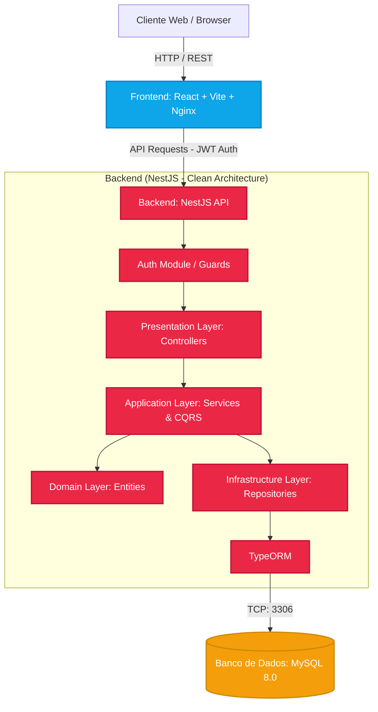

# 📈 Portal Financeiro - Corretagem White Label


Uma plataforma completa e moderna de corretagem digital em formato White Label. Este projeto oferece dashboards interativos para visualização de ativos, carteiras de investimento e operações financeiras, integrando um frontend altamente responsivo com uma API backend robusta e escalável.

## 📋 Índice

- [Arquitetura Técnica](#-arquitetura-técnica)
- [Tecnologias Utilizadas](#-tecnologias-utilizadas)
- [Pré-requisitos](#-pré-requisitos)
- [Instalação e Configuração](#-instalação-e-configuração)
- [Ambiente de Desenvolvimento](#-ambiente-de-desenvolvimento)
- [Estrutura do Projeto](#-estrutura-do-projeto)
- [Documentação da API](#-documentação-da-api)
- [Licença](#-licença)

---

## 🏗 Arquitetura Técnica

O projeto foi concebido seguindo princípios de **Domain-Driven Design (DDD)** e arquitetura em camadas (Clean Architecture) para garantir manutenibilidade, separação de responsabilidades e escalabilidade, orquestrada via Docker.

### Diagrama de Componentes



---

## 💻 Tecnologias Utilizadas

### Frontend
| Tecnologia | Versão | Descrição |
|------------|--------|-----------|
| **React** | 18.x | Biblioteca para construção de interfaces |
| **Vite** | 5.x | Ferramenta de build super rápida |
| **TypeScript** | 5.x | Tipagem estática para JavaScript |
| **Tailwind CSS** | 3.x | Framework de CSS utilitário |
| **Lucide React** | ^0.x | Biblioteca de ícones |
| **Zustand** | ^4.x | Gerenciamento de estado global |
| **Recharts** | ^2.x | Gráficos financeiros interativos |

### Backend
| Tecnologia | Versão | Descrição |
|------------|--------|-----------|
| **Node.js** | 20.x | Ambiente de execução JavaScript |
| **NestJS** | 10.x | Framework principal e Clean Architecture |
| **TypeScript** | 5.x | Linguagem de programação |
| **Passport.js** | - | Autenticação e autorização (JWT) |
| **TypeORM** | - | Persistência de dados e ORM |
| **CQRS** | - | Separação de comandos e consultas |

### Infraestrutura & Banco de Dados
| Tecnologia | Versão | Descrição |
|------------|--------|-----------|
| **MySQL** | 8.0 | Banco de dados relacional |
| **Docker** | Latest | Containerização da aplicação |
| **Docker Compose**| Latest | Orquestração de containers |
| **Nginx** | Alpine | Servidor web para o frontend |

---

## ⚙️ Pré-requisitos

Para executar o projeto localmente, você precisará ter instalado:
- [Docker](https://docs.docker.com/get-docker/) e [Docker Compose](https://docs.docker.com/compose/install/)
- [Node.js](https://nodejs.org/) (v20+) - *Para desenvolvimento local*

---

## 🚀 Instalação e Configuração

A maneira mais fácil e recomendada de executar a aplicação completa é usando Docker.

1. **Clone o repositório:**
   ```bash
   git clone https://github.com/seu-usuario/portal-financeiro.git
   cd portal-financeiro
   ```

2. **Suba os containers usando o Docker Compose:**
   ```bash
   docker-compose up -d --build
   ```

3. **Acesse as aplicações:**
   - **Frontend:** [http://localhost](http://localhost)
   - **Backend API:** [http://localhost:3001](http://localhost:3001)
   - **Swagger UI (Docs da API):** [http://localhost:3001/api/docs](http://localhost:3001/api/docs)

   > **Nota sobre o Banco de Dados**: Na primeira vez que o backend subir com sucesso, o `SeederService` irá rodar automaticamente e injetar dados iniciais de demonstração (Ações, Índices e Usuários). O usuário padrão é `admin@portal.com` com a senha `admin123`.

4. **Para parar os containers:**
   ```bash
   docker-compose down
   ```

---

## � Ambiente de Desenvolvimento

Se você deseja rodar as aplicações sem Docker para desenvolvimento:

### Backend (NestJS)
```bash
cd backend
# Inicie o banco de dados via Docker:
docker-compose up -d db

# Instale as dependências e inicie a aplicação
npm install
npm run start:dev
```
O servidor estará rodando em `http://localhost:3001`.

### Frontend (React + Vite)
```bash
cd Portal-Financeiro-Corretagem-White-Label-
# Instale as dependências
npm install

# Inicie o servidor de desenvolvimento
npm run dev
```
O frontend estará disponível em `http://localhost:5173`.

---

## � Estrutura do Projeto

```text
PortalFinanceiro/
├── docker-compose.yml       # Orquestração dos containers (DB, Backend, Frontend)
├── backend/                 # Aplicação NestJS API
│   ├── src/                 # Código fonte do Backend
│   │   ├── modules/         # Domínios: auth, market, orders, portfolio, users
│   │   └── shared/          # Recursos compartilhados
│   ├── Dockerfile           # Configuração de build Multi-stage do Backend
│   └── package.json         # Dependências do NPM
└── Portal-Financeiro-Corretagem-White-Label-/ # Aplicação React + Vite
    ├── src/                 # Código fonte Frontend
    │   ├── components/      # Componentes UI reutilizáveis e Layout
    │   ├── pages/           # Telas principais da aplicação
    │   ├── services/        # Integração com API
    │   └── store/           # Gerenciamento de estado (Zustand)
    ├── Dockerfile           # Configuração de build Multi-stage (Node -> Nginx)
    ├── nginx.conf           # Configuração do Nginx para roteamento SPA
    └── package.json         # Dependências do NPM
```

---

## 📖 Documentação da API

A documentação interativa da API é gerada automaticamente pelo **Swagger**. 
Com o backend rodando, acesse `http://localhost:3001/api/docs` no seu navegador para visualizar, explorar e testar os endpoints disponíveis na plataforma.

---

## 📄 Licença

Este projeto está licenciado sob a Licença MIT - veja o arquivo [LICENSE](LICENSE) para detalhes.
